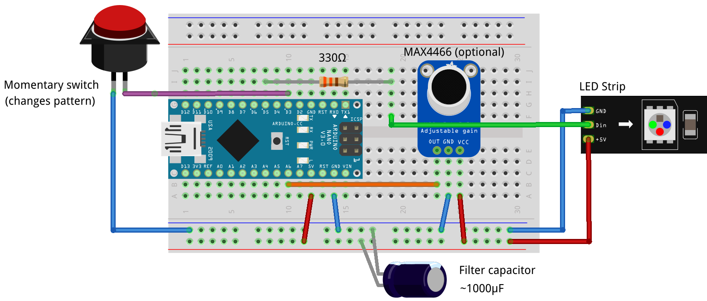

# LEDMask
Arduino code using FastLED to display patterns on an irregular matrix, in this case a slightly disturbing looking mask. It will run on pretty much anything from the Nano upwards, and will compile for the ESP32 / ESP8266 etc.

## FastLED Map Generator
FastLED XY example code for rectangular matrix: https://github.com/FastLED/FastLED/bl...
FastLED XY Map Generator: https://macetech.github.io/FastLED-XY...

## Sound - Microphone
The microphone is optional, it enables the 'Sound' pattern to respond to your voice (or other noises). Without it, the rest of the patterns will still work. The filter capacitor is not optional if you are using the microphone. Without it, the microphone signal is very noisy and so the 'Sound' pattern doesn't work. Short-pressing the button cycles through the patterns, whilst a long-press will set it to change the pattern automatically every 10 seconds.

## Why are the patterns all classes?
Ah, glad you asked! This was originally written for the Arduino Nano which is relatively short of RAM. Using large numbers of LEDs with the Nano quickly consumes the available memory so it's difficult to write multiple patterns. By writing each pattern as a class, the variables and arrays that each pattern needs are only held in RAM while that pattern is active. As soon as the pattern changes, the class object loses scope and releases the RAM to be used by the next pattern. In this way we can add many more patterns than we otherwise would be able to.
